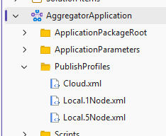

<div align="center">

### 🛡️ Status

```text
╔══════════════════════════════════════════════════════════════╗
║               __                                             ║
║              / _)                                            ║
║       .-^^^-/ /                                              ║
║    __/       /                                               ║
║   <__.|_|-|_|                                                ║
║                                                              ║
║   rawr - your sfproj files are safe now                      ║
╚══════════════════════════════════════════════════════════════╝
```

**Built with 💜 for everyone still running Service Fabric in production**

*Because not everything needs to be migrated to Kubernetes 😄*

# 🦕 ServiceFabricBack

### *Bringing `.sfproj` back from extinction in Visual Studio 2026*

[](https://visualstudio.microsoft.com/)
[](https://learn.microsoft.com/azure/service-fabric/)
[](LICENSE.txt)

</div>

## 🦖 About

Visual Studio 2026 does not include built-in support for **Service Fabric Application projects (`.sfproj`)**. If you have existing Service Fabric solutions, sfproj projects may show up as ***"(incompatible)"*** and won't load:

```diff
-  ❌  ContosoApplication (incompatible)
```

This extension adds `.sfproj` support back.

```diff
+  ✅  ContosoApplication
```

> [!NOTE]
> For background on the SF project system, see [microsoft/service-fabric#885](https://github.com/microsoft/service-fabric/issues/885). This extension fills the gap by implementing the project system interfaces directly.

<br/>

<div align="center">



*`.sfproj` project loaded in Visual Studio 2026 with full file tree and custom icons*

</div>

<br/>

## ✨ Features

| Feature | Status |
|:--------|:------:|
| Load `.sfproj` projects in Solution Explorer | ✅ |
| Full project tree — ApplicationPackageRoot, ApplicationParameters, PublishProfiles, Scripts | ✅ |
| Double-click to open files in the appropriate VS editor | ✅ |
| Custom modern icons (microservices mesh, type-specific file icons) | ✅ |
| Project references display | ✅ |
| New project template for SF Applications | ✅ |
| MSBuild targets for build/package workflow | ✅ |
| SF SDK deployment integration | 🔜 |
| Service Fabric cluster management UI | 🔜 |
| Add/remove service dialogs | 🔜 |

<br/>

## 🚀 Getting Started

### Prerequisites

- **Visual Studio 2026** (version 18.x)
- The **"Visual Studio extension development"** workload — needed only if building from source

> [!TIP]
> You can add the workload via **Visual Studio Installer → Modify → Other Toolsets → Visual Studio extension development**.

<br/>

## 📦 Installation

### Option 1 — Download from GitHub Releases (quickest)

1. Go to the [**Releases**](../../releases) page
2. Download **`ServiceFabricBack.vsix`** from the latest release
3. **Double-click** the `.vsix` file to install
4. **Restart Visual Studio**
5. Open your Service Fabric solution — all `.sfproj` projects should load ✅

### Option 2 — Build & install from Visual Studio

This is the simplest way if you already have VS 2026 open:

1. **Clone or download** this repository
2. **Open** `ServiceFabricBack.sln` in Visual Studio 2026
3. Make sure the **"Visual Studio extension development"** workload is installed
4. Set configuration to **Debug** and press **`Ctrl+Shift+B`** to build
5. The VSIX is generated at:
   ```
   ServiceFabricBack\bin\Debug\ServiceFabricBack.vsix
   ```
6. **Double-click** the `.vsix` file to install
7. **Restart Visual Studio**
8. Open your Service Fabric solution — all `.sfproj` projects should load ✅

### Option 3 — Build from command line

```powershell
# Clone
git clone https://github.com/igor-nesterov/ServiceFabricIsBack.git
cd ServiceFabricBack

# Build (adjust the VS edition path if needed: Community/Professional/Enterprise)
& "C:\Program Files\Microsoft Visual Studio\18\Enterprise\MSBuild\Current\Bin\MSBuild.exe" `
    ServiceFabricBack\ServiceFabricBack.csproj /t:Build /p:Configuration=Release

# Install — double-click or run:
Start-Process "ServiceFabricBack\bin\Release\ServiceFabricBack.vsix"
```

> [!TIP]
> Pre-built VSIX binaries are available on the [Releases](../../releases) page. If you prefer to build from source, use Option 2 or 3 above.

### Verifying installation

After restart, go to **Extensions → Manage Extensions** and confirm you see:

> **Service Fabric Project Support** `1.0` — *Igor Nesterov*

<br/>

## 🏗️ How it Works

Since `.sfproj` doesn't have a built-in project system in VS 2026, this extension implements the VS extensibility interfaces directly:

```
                    ┌────────────────────────────────┐
                    │     Visual Studio 2026          │
                    │                                │
                    │  .sln references project with   │
                    │  GUID {A07B5EB6-E848-...}      │
                    └───────────────┬────────────────┘
                                    │
                                    ▼
                    ┌────────────────────────────────┐
                    │     SFProjectFactory            │
                    │     (IVsProjectFactory)         │
                    │                                │
                    │  Registered for the well-known  │
                    │  SF project type GUID           │
                    └───────────────┬────────────────┘
                                    │ creates
                                    ▼
┌──────────────┐    ┌────────────────────────────────┐
│              │    │     SFProjectHierarchy          │
│   SFIcons    │───▶│     (IVsHierarchy,             │
│  (GDI+ art)  │    │      IVsProject,               │
│              │    │      IVsUIHierarchy)            │
└──────────────┘    │                                │
                    │  • Parses .sfproj MSBuild XML   │
                    │  • Builds file/folder tree      │
                    │  • Opens files via standard     │
                    │    VS editor infrastructure     │
                    └────────────────────────────────┘
```

| Component | Role |
|:----------|:-----|
| **`ServiceFabricBackPackage`** | VS Package entry point — registers the factory on load |
| **`SFProjectFactory`** | `IVsProjectFactory` registered under GUID `{A07B5EB6-E848-4116-A8D0-A826331D98C6}` |
| **`SFProjectHierarchy`** | Parses `.sfproj` XML, extracts `None`/`Content`/`ProjectReference` items, builds Solution Explorer tree |
| **`SFIcons`** | Generates all icons programmatically — microservices mesh, colored file type icons, folders |

<br/>

## 📁 Project Structure

```
ServiceFabricBack/
│
├── 📄 ServiceFabricBack.sln
│
└── ServiceFabricBack/
    ├── 🔧 Guids.cs                        # Package + project type GUIDs
    ├── 📦 ServiceFabricBackPackage.cs      # VS Package — registers factory
    ├── 🏭 SFProjectFactory.cs             # IVsProjectFactory for .sfproj
    ├── 🌳 SFProjectHierarchy.cs           # IVsHierarchy — project tree
    ├── 🎨 SFIcons.cs                      # Programmatic icon generation
    ├── 📋 source.extension.vsixmanifest   # VSIX metadata
    │
    ├── BuildTargets/
    │   ├── ServiceFabric.props            # MSBuild properties
    │   └── ServiceFabric.targets          # Build/package targets
    │
    └── ProjectTemplates/
        └── ServiceFabricApplication/      # "New Project" template
            ├── Application.sfproj
            ├── ApplicationPackageRoot/
            ├── ApplicationParameters/
            ├── PublishProfiles/
            └── Scripts/
```

<br/>

## ⚙️ Configuration

| Environment Variable | Values | Default | Description |
|:---------------------|:-------|:--------|:------------|
| `SERVICEFABRICBACK_TRACE` | `1` / `true` / `on` | *(not set)* | Enables detailed hierarchy tracing to `%TEMP%\ServiceFabricBack.Hierarchy.log` — useful for bug reports |

Set these as **User** or **System** environment variables, then restart Visual Studio.

<br/>

## 🤝 Contributing

PRs and issues are welcome! Here's what could use help:

| Area | Description | Difficulty |
|:-----|:------------|:----------:|
| 🔨 Build integration | Wire MSBuild targets to invoke SF packaging | Medium |
| 🚀 Deployment | "Publish" context menu → runs deploy script | Medium |
| 🎨 Better icons | SVG-based `ImageMoniker` support | Easy |
| ⚙️ Property pages | Project settings UI for SF-specific config | Hard |
| 🧪 Testing | Add integration tests with experimental VS instance | Medium |

<br/>

## 📜 License

[MIT](LICENSE.txt) — use it however you want.

<br/>

---

<div align="center">

<br/>

```
        __
       / _)   rawr — your sfproj files are safe now
      / /
 ____/ /
(____ /
```

<br/>

**Built with 💜 for everyone still running Service Fabric in production**

*Because not everything needs to be migrated to Kubernetes* 😄

<br/>

</div>